# liri-node-app

LIRI is like iPhone's SIRI. However, while SIRI is a Speech Interpretation and Recognition Interface, LIRI is a _Language_ Interpretation and Recognition Interface. LIRI is a command line node app that takes in parameters and gives you back data.

LIRI is able to search Spotify for songs, OMDB for movies, and Bands in Town for concerts utilizing requests to the associated APIs.

To begin, open the the terminal, and navigate to the root menu and install the dependencies by typing npm install

Once all dependencies are installed, navigate to the liri.js file in the terminal and begin by typing node liri.js

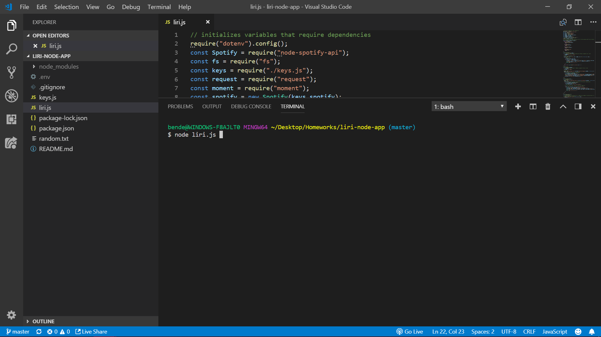

from here, LIRI is able to take the following commands: 

* `spotify-this-song`

* `movie-this`

* `concert-this`

* `do-what-it-says`

If the user wants to search a song, after node liri.js they would type spotify-this-song and then a song name.

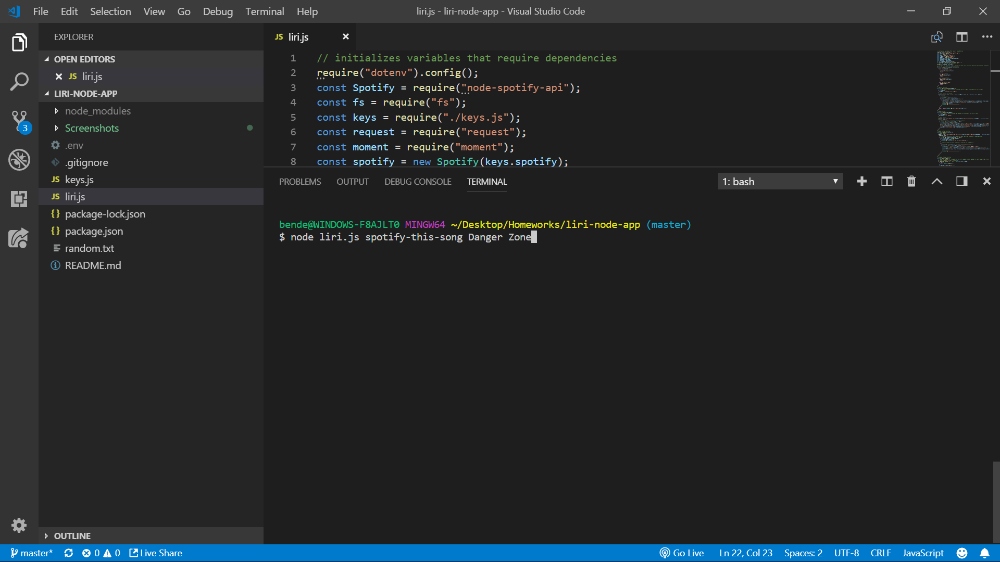

When the user presses enter, a request is made to the Spotify API, and a response is logged with the following displayed for all the results:

* Artist(s)
* The song's name
* A preview link of the song from Spotify
* The album that the song is from

The API will return all results associated with the provided song name

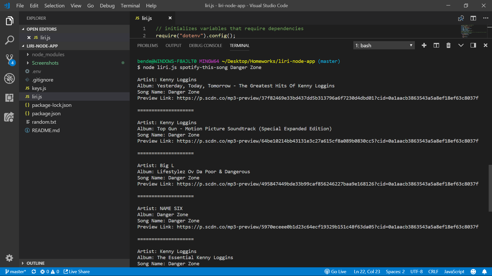

If the user does not provide a song choice after node liri.js spotify-this-song...

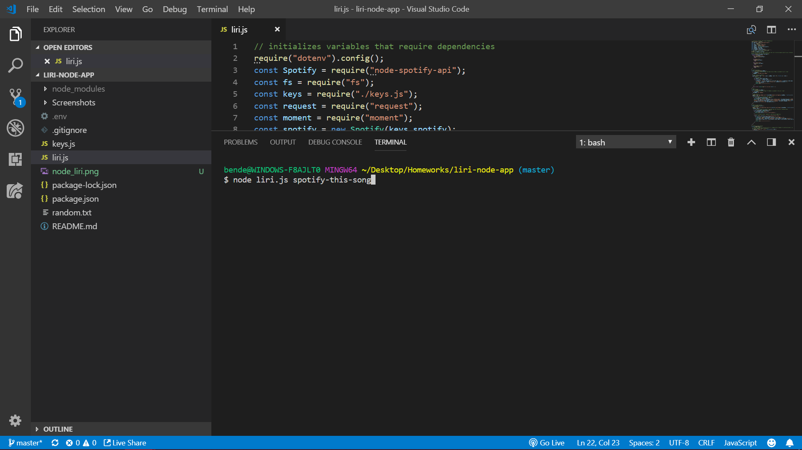

 ...LIRI defaults the user choice to "The Sign" by the band Ace of Base and returns the Spotify API response as before:

 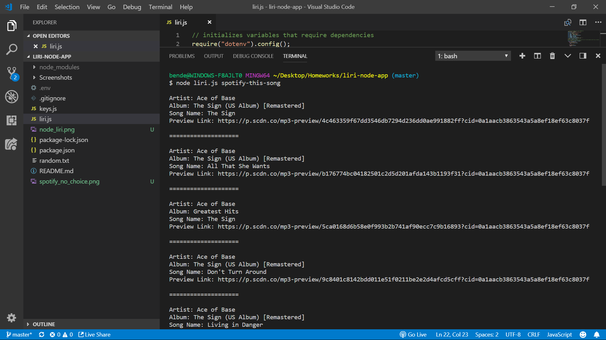

 If the user wants to search for a movie, after node liri.js they would type movie-this and then a movie name.

 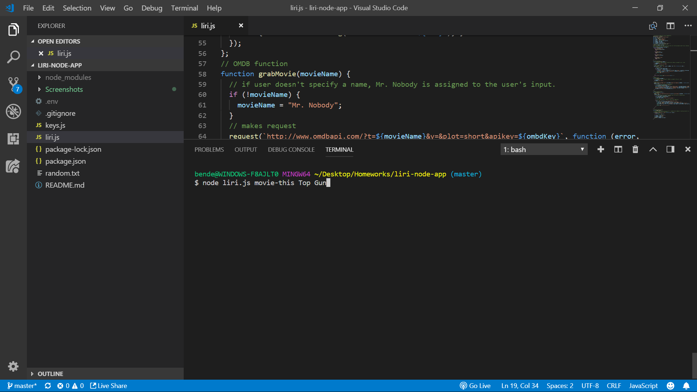

 When the user presses enter, a request is made to the OMDB API, and a response is logged with the following displayed:

* Title of the movie.
* Year the movie came out.
* IMDB Rating of the movie.
* Rotten Tomatoes Rating of the movie.
* Country where the movie was produced.
* Language of the movie.
* Plot of the movie.
* Actors in the movie.

The API will return the results associated with the provided movie name

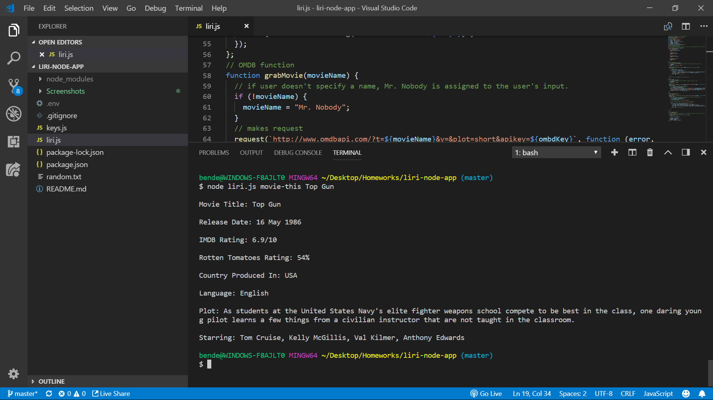

If the user does not provide a movie choice after node liri.js movie-this...

...LIRI defaults the user's choice to "Mr. Nobody" and returns the OMDB API response as before:

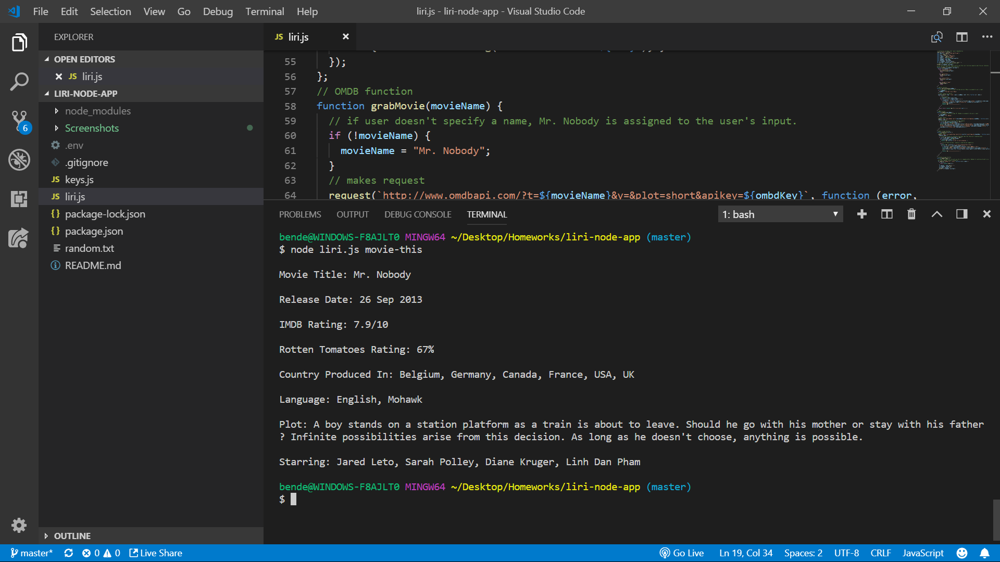

If the user wants to search for a band/artist to see what concerts they're playing, after node liri.js they would type concert-this and then a band's/artist's name.

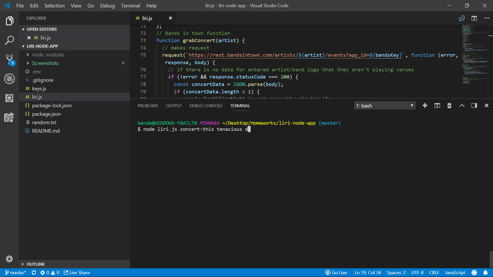

When the user presses enter, a request is made to the Bands in Town API, and a response is logged with the following displayed:

* Name of the venue
* Venue location
* Date of the Event

The API will return all the venue the results associated with the provided band/artist name.

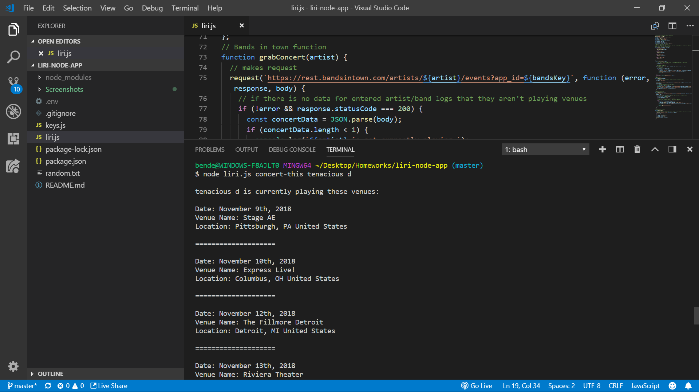

If the user picks a band/artist that doesn't retun any results, it is logged that they aren't currently playing any venues:

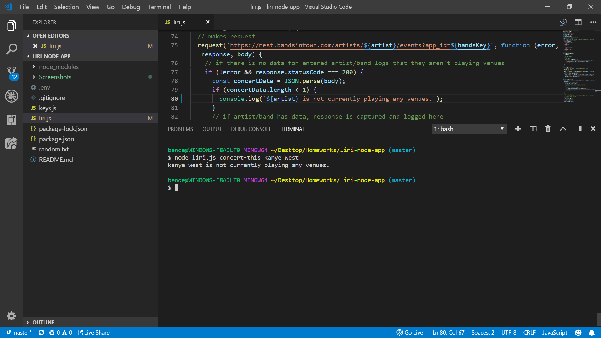

There is one last function that LIRI can perform called do-what-it says.  The user can call this function by typing node liri.js do-what-it-says.

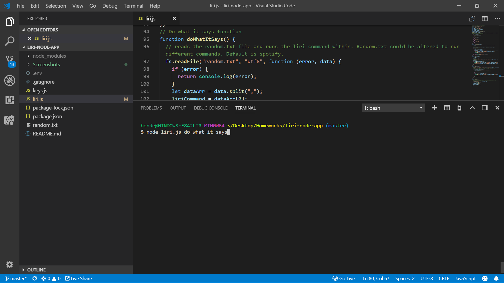

The do-what-it-says function uses the fs package to read the random.txt file, and logs the content as the LIRI command and user input variables.

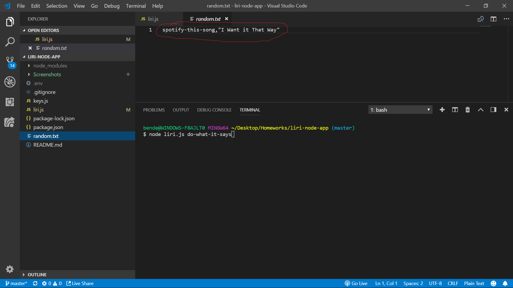

Depending on what command and value the random.txt file holds, LIRI will run the corresponding function.  My file holds the spotify-this-song command and the song "I Want it That Way" by the Backstreet Boys.

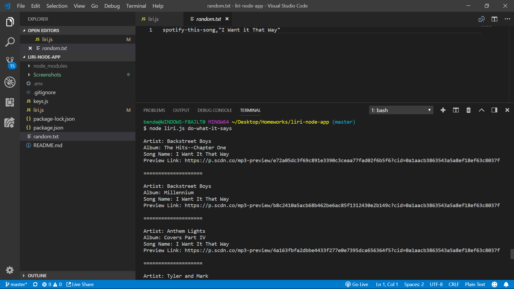

This file could be altered to run any command/value that is desired.

This wraps up the functionality of the LIRI app, and I hope you enjoy using it!